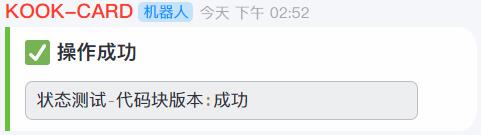

import { Tab, Tabs } from 'rspress/theme';
import Table from '../../components/Tables'

# 状态卡片 - 代码块
对状态卡片的另一种展现形式

### 效果预览

### 调用函数
函数名
`reply_tips`

### API 函数参数说明

<Table rowData={[['text','string','是','-','卡片内传入的内容'],['status','"success" | "warning" | "error"','否','"success"','卡片颜色状态']]}></Table>
