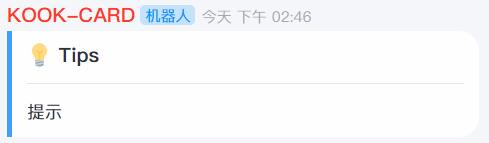

import { Tab, Tabs } from 'rspress/theme';
import Table from '../../components/Tables'

# 提示卡片
用来当作展现简单提示

### 效果预览

### 调用函数
函数名
`reply_tips`

### API 函数参数说明

<Table rowData={[['text','string','是','-','卡片内传入的内容'],['color','string','否','"#409EFF"','卡片颜色，填写颜色16进制值'],['show_divider','boolean','否','True','是否显示分割线']]}></Table>
